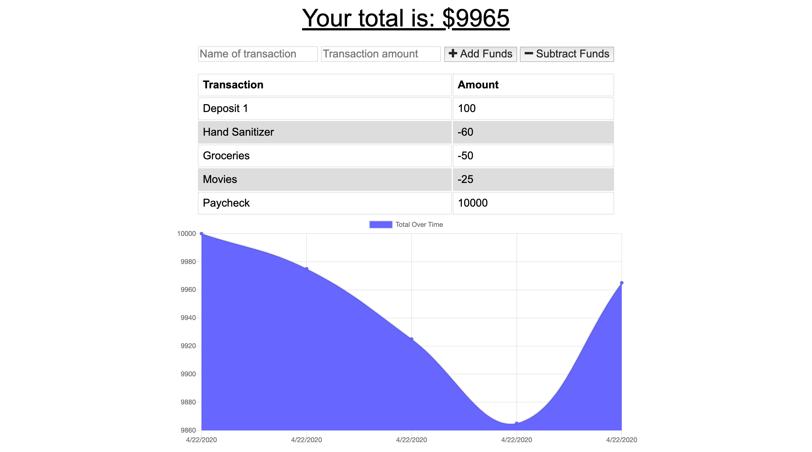
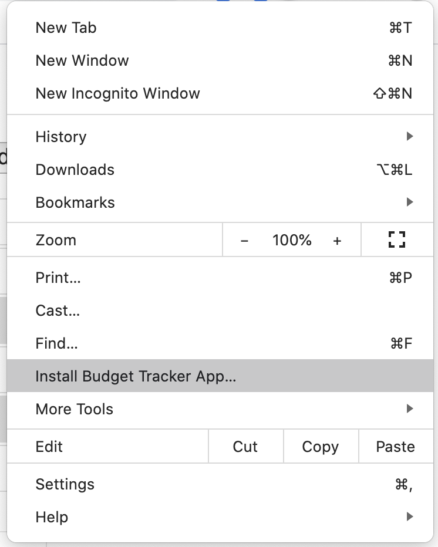
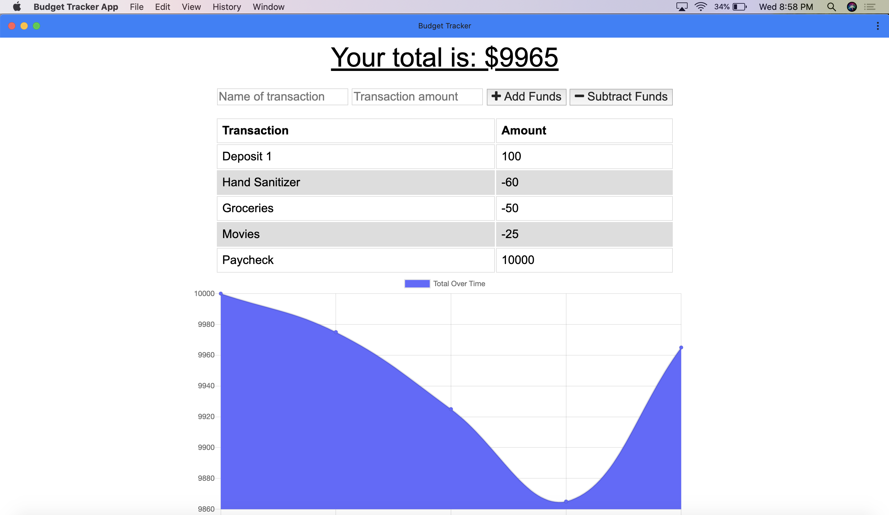

Online/Offline Budget Tracker  

This is a Progressive Web Application that allows offline access and functionality.  

The user is able to add expenses and deposits to the Budget Tracker with or without a connection. Entered transactions offline will populate when back online.  

  

Install the App.  

  

Your Budget Tracker is now a local app to use on and offline!  

  

Deployed link:  
https://offline-budget-tracker-app.herokuapp.com/  

Built with:  
Node.js  
Express  
MongoDB    
Javascript  
CSS  
HTML  

Authors:  
Ilana Shaffer  